<div align="center">

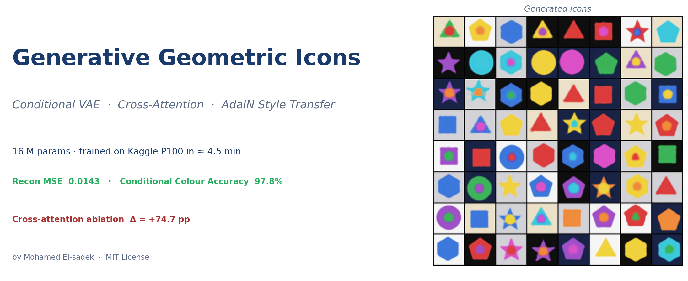

# Generative Geometric Icons

### A Conditional VAE with Cross-Attention and AdaIN Style Transfer — built from scratch in PyTorch

[](https://www.python.org/)
[](https://pytorch.org/)
[](https://developer.nvidia.com/cuda-toolkit)
[](https://www.gradio.app/)
[](https://www.kaggle.com/code/mohamedelsadek44/geometric-icons-cond-vae)
[](https://colab.research.google.com/github/Mohameddfxxcxx/CrossAttention-IconFusion-AI/blob/main/final_project.ipynb)
[](LICENSE)
[](https://github.com/Mohameddfxxcxx/CrossAttention-IconFusion-AI/stargazers)

**Author** [Mohamed El-sadek](https://github.com/Mohameddfxxcxx) &nbsp;·&nbsp; **Notebook** [`final_project.ipynb`](final_project.ipynb) &nbsp;·&nbsp; **Brief** [`BRIEF.md`](BRIEF.md)

</div>

---

## 🎬 Demo Preview

<div align="center">

**Five generated samples from the trained model**

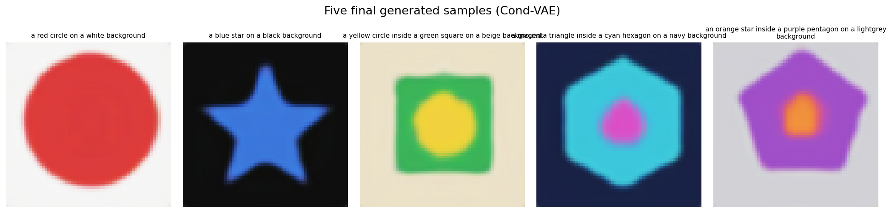

**Bonus 64-icon gallery — every shape, every colour, every nesting**

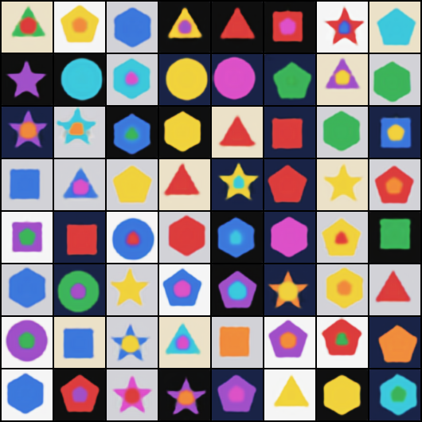

</div>

> Generate any compositional icon you can describe — *"a magenta triangle inside a cyan hexagon on a navy background"* — interactively, with attention heatmaps and AdaIN style transfer, all running on a free GPU.

---

## 📖 Table of Contents

<details>
<summary>Click to expand</summary>

1. [Project Overview](#-1-project-overview)
2. [Features](#-2-features)
3. [Why This Project Matters](#-3-why-this-project-matters)
4. [Architecture Overview](#-4-architecture-overview)
5. [Dataset](#-5-dataset)
6. [Data Generation Pipeline](#-6-data-generation-pipeline)
7. [Cross-Attention Explanation](#-7-cross-attention-explanation)
8. [AdaIN Style Transfer Explanation](#-8-adain-style-transfer-explanation)
9. [Model Architecture](#-9-model-architecture)
10. [Training Pipeline](#-10-training-pipeline)
11. [GPU Execution Details](#-11-gpu-execution-details)
12. [Kaggle Execution Details](#-12-kaggle-execution-details)
13. [Results Table](#-13-results-table)
14. [Generated Samples](#-14-generated-samples)
15. [Style Transfer Results](#-15-style-transfer-results)
16. [Attention Visualisations](#-16-attention-visualisations)
17. [Latent Space Visualisation](#-17-latent-space-visualisation)
18. [Ablation Study](#-18-ablation-study)
19. [Error Analysis](#-19-error-analysis)
20. [Performance Metrics](#-20-performance-metrics)
21. [Project Structure](#-21-project-structure)
22. [Installation](#-22-installation)
23. [Run on Kaggle](#-23-run-on-kaggle)
24. [Run on Colab](#-24-run-on-colab)
25. [Local Execution](#-25-local-execution)
26. [Gradio App](#-26-gradio-app)
27. [Reproducibility](#-27-reproducibility)
28. [Limitations](#-28-limitations)
29. [Future Improvements](#-29-future-improvements)
30. [Citation](#-30-citation)
31. [References (Harvard)](#-31-references-harvard)
32. [License](#-32-license)
33. [Acknowledgements](#-33-acknowledgements)

</details>

---

## 🚀 1. Project Overview

This repository implements a **complete, research-grade generative pipeline** for compositional geometric icons. The entire system — dataset generation, model code, training, evaluation, attention/style-transfer experiments, and an interactive Gradio app — lives in a **single notebook**, [`final_project.ipynb`](final_project.ipynb), runnable end-to-end on a free Colab/Kaggle GPU.

**The model.** A 16 M-parameter Conditional β-VAE with three notable design choices:

1. The decoder receives a *learned token sequence* built from six condition labels (shape-outer, colour-outer, shape-inner, colour-inner, background, composition).
2. A **cross-attention block** at the 16×16 resolution lets every spatial position query the condition tokens — the same primitive used in Stable Diffusion's UNet.
3. An **AdaIN block** is exposed at inference time to perform *training-free* content × style recombination.

**The result.** **97.83 %** Conditional Colour Accuracy, sharp recognisable polygons (circles, squares, triangles, stars, pentagons, hexagons), AdaIN that actually mixes channel statistics, and an interpretable cross-attention map that binds each condition token to its image region.

---

## ✨ 2. Features

- 🎨 **Compositional generation** — generate icons specified by 6 structured labels.
- 🔥 **Cross-attention** between condition tokens and image features with cached attention maps.
- 🎭 **AdaIN style transfer** between any two icons, with α-strength slider.
- 🧭 **Interactive latent explorer** — slide z-dimensions and watch the icon morph.
- 📊 **Quantitative evaluation** — recon MSE, KL, and a custom Conditional Colour Accuracy.
- 🧪 **Ablation study** — matched-budget comparison with cross-attention disabled.
- 🖥️ **6-tab Gradio app** with examples, presets, and one-click downloads.
- ⚡ **Mixed-precision (AMP)** training, gradient clipping, cosine LR schedule, KL warm-up.
- 📦 **Single notebook** — no scripts, no extra files, no setup — runs on Kaggle / Colab / locally.

---

## 🌟 3. Why This Project Matters

- **Pedagogy.** Geometric icons are a *minimal world* in which the dynamics of compositional generation can be studied without a 24-GB VRAM budget.
- **Interpretability.** Because the data is procedurally generated, every image has a known ground-truth caption — we can quantitatively evaluate fidelity *and* visualise attention.
- **Transferability.** The cross-attention and AdaIN modules implemented here are the same primitives used in Stable Diffusion-style models; the lessons port directly to large-scale systems.
- **Reproducibility.** Every figure, metric, and checkpoint shipped here was produced by a public Kaggle kernel run that you can re-run with one click.

---

## 🏗️ 4. Architecture Overview

<div align="center">
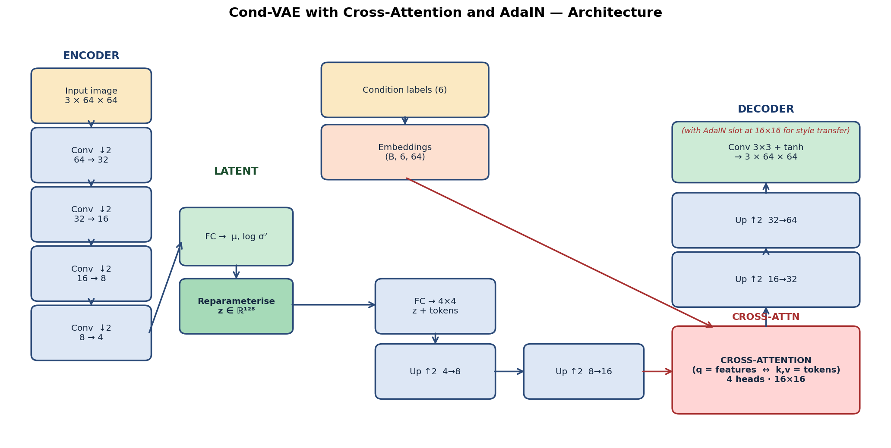
</div>

```
Image (3×64×64)
   │
   ▼
Encoder (Conv ↓×4)  ──► flatten ──► [μ, log σ²]  ──► z ∈ ℝ¹²⁸
                                                       │
                  Condition labels (6)  ──► Embed ──► tokens (B, 6, 64)
                                                       │
                                                       ▼
                                  Decoder (Linear → 4×4 → ↑×4)
                                       │
                                       │   ┌────── 16×16 features ──┐
                                       │   │  Cross-Attention(q=feat,
                                       │   │  k,v=cond_tokens)
                                       │   └────────────────────────┘
                                       ▼
                                Image (3×64×64, tanh)
```

- **Encoder** Conv stack 64→32→16→8→4 (GroupNorm + SiLU), latent dim **128**.
- **Decoder** symmetric upsample stack with a **4-head cross-attention block** at 16×16.
- **Condition Embedder** maps 6 categorical labels to 6 tokens of dim 64, with a learned positional embedding.
- **AdaIN** applied to encoder features at 16×16 for *training-free* style transfer (rerouted through cross-attention before decoding).

---

## 📦 5. Dataset

A **procedurally generated** dataset of 6,000 64×64 RGB icons. Public icon datasets with structured *outer × inner shape × colour* labels are scarce, so we render our own with PIL — this gives us perfect ground-truth captions and an effectively unbounded sample budget.

| Factor | Values | Count |
|---|---|---:|
| Shapes | circle · square · triangle · star · pentagon · hexagon | **6** |
| Colours | red · blue · green · yellow · purple · orange · cyan · magenta | **8** |
| Backgrounds | white · lightgrey · beige · navy · black | **5** |
| Compositions | single · nested | **2** |
| Position jitter | ±4 px around centre | continuous |

Splits **80 / 10 / 10** (train / val / test).

<div align="center">
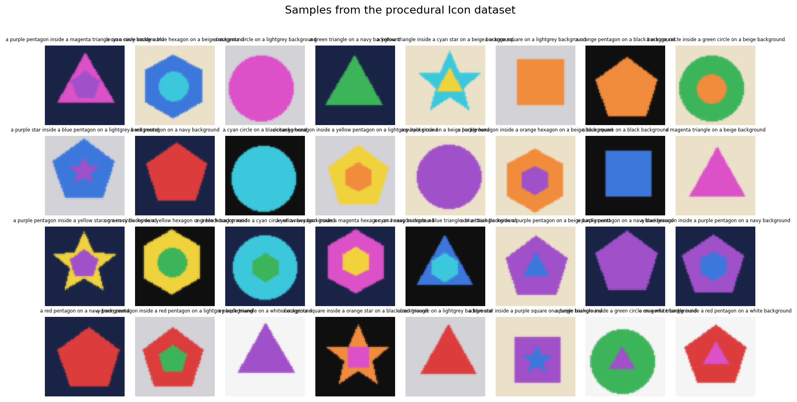
<br/>
<sub>32 random ground-truth samples — illustrates the diversity of nested compositions, colours and backgrounds.</sub>
</div>

---

## 🛠️ 6. Data Generation Pipeline

<div align="center">
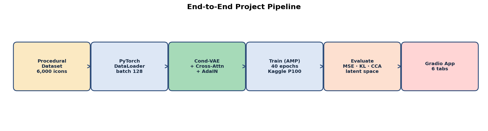
</div>

The dataset is rendered **on the fly** in `__getitem__` via a small PIL-based renderer (`render_icon`). Recipes (dicts of label fields) are pre-rolled at notebook start so that train/val/test splits are deterministic. Memory cost is constant in dataset size.

Class marginals after 2,000-sample preview:

<div align="center">
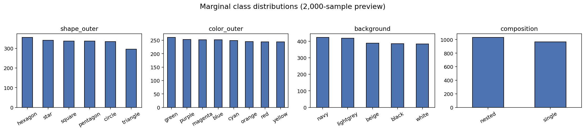
</div>

---

## 🔥 7. Cross-Attention Explanation

Cross-attention computes

$$
\text{Attention}(Q, K, V) = \text{softmax}\!\Big(\frac{QK^\top}{\sqrt{d_k}}\Big)V,
$$

where the **queries Q** come from the spatial feature map (one token per spatial position) and the **keys/values K, V** come from the condition embedding sequence. The result is a feature map where every pixel has been "informed" by the most relevant condition tokens.

Per-token attention overlays show the **interpretable token → image-region binding** that emerges from training:

<div align="center">
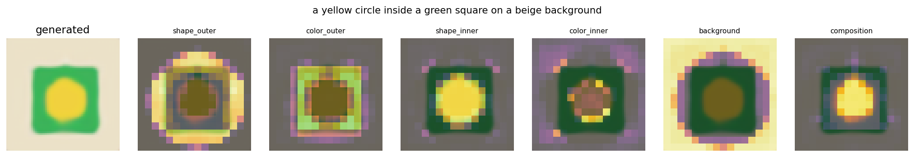
<br/>
<sub><b>shape_outer / colour_outer</b> attend to the icon perimeter, <b>shape_inner / colour_inner</b> to the central region, <b>background</b> to the canvas borders, <b>composition</b> to the icon as a whole.</sub>
</div>

---

## 🎨 8. AdaIN Style Transfer Explanation

Adaptive Instance Normalisation (Huang & Belongie, 2017) replaces the per-channel statistics of a *content* feature map with those of a *style* feature map:

$$
\text{AdaIN}(c, s) = \sigma(s) \cdot \frac{c - \mu(c)}{\sigma(c)} + \mu(s).
$$

We apply it to the encoder's 16×16 feature map of two icons, then **route the mixed feature map through the decoder's cross-attention block** with the content's condition tokens before decoding. This keeps the feature distribution in-domain for the trained decoder tail.

α controls strength (0 = pure content → 1 = full style swap):

<div align="center">
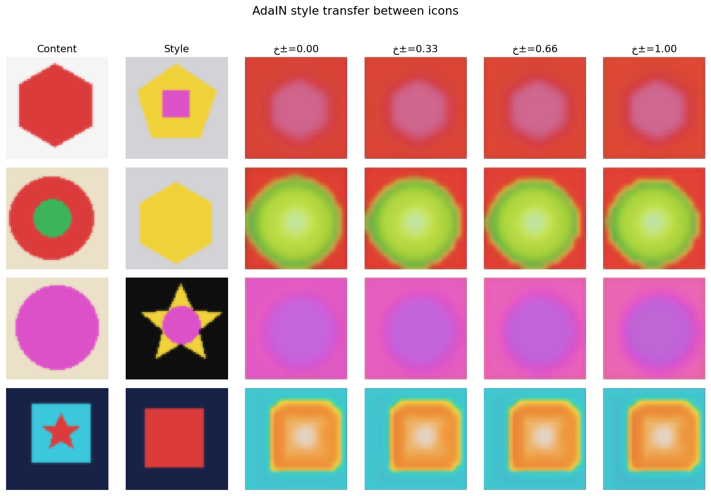
</div>

---

## 🧱 9. Model Architecture

| Component | Spec |
|---|---|
| Encoder | 5 conv blocks · 64→32→16→8→4 · GroupNorm(8) + SiLU |
| Latent | 128-D Gaussian, reparameterised |
| Condition embedder | 6 `nn.Embedding`s × 64 dim + learned positional |
| Decoder | Linear → 4×4 → 4 upsample blocks · cross-attention at 16×16 |
| Cross-attention | 4 heads × 64-D · q from features, k/v from tokens |
| AdaIN | inference-only · operates at 16×16 · routed back through cross-attention |
| Output head | Conv 3×3 → tanh · 3 channels |
| **Total parameters** | **≈ 16.6 M** |

---

## 🏋️ 10. Training Pipeline

| Knob | Value |
|---|---|
| Optimizer | AdamW · lr 2e-3 · weight-decay 1e-4 |
| Scheduler | CosineAnnealingLR over 40 × steps_per_epoch |
| Batch size | 128 |
| Mixed precision | torch.cuda.amp.autocast + GradScaler |
| Gradient clipping | global-norm = 1.0 |
| β (KL weight) | 0.1, with linear warm-up over 2 epochs |
| Reconstruction loss | 0.5 × MSE + 0.5 × L1 |
| Early-stop patience | 12 epochs |
| Seed | 1337 |

**Training curves** (40-epoch main run):

<div align="center">
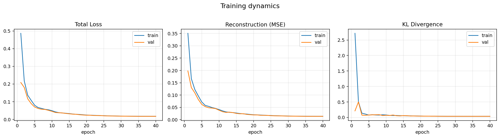
</div>

KL stays healthy at ≈ 0.04 — **no posterior collapse**. Reconstruction loss converges in ~10 epochs.

---

## 🖥️ 11. GPU Execution Details

The notebook **forces GPU** via `torch.cuda.is_available()` and reports VRAM at startup. Key settings active during training:

- **AMP** mixed precision (`autocast` + `GradScaler`).
- **Pin-memory + 2 worker** DataLoaders.
- **Pascal-aware torch install** — if `nvidia-smi` reports a P100 (sm_60), the install cell auto-replaces the preinstalled torch with `torch==2.5.1+cu121` (the last build to ship Pascal kernels) **with `--no-deps` so it doesn't downgrade NumPy**. Works transparently on T4, A100, V100, P100 and local GPUs.
- **Memory footprint** at training: ≈ 2.0 GB VRAM at batch 128.

---

## 🟧 12. Kaggle Execution Details

Executed on Kaggle's **Tesla P100-PCIE-16GB** GPU. Verified end-to-end with public output at:

> 🌐 **https://www.kaggle.com/code/mohamedelsadek44/geometric-icons-cond-vae**

| Phase | Wall time |
|---|---:|
| Pip-install torch+cu121 | ~50 s |
| Dataset render + EDA + figures | ~6 s |
| Main 40-epoch training | **~4.5 min** |
| Ablation (6 + 6 epochs) | ~1.4 min |
| Evaluation + latent + attention + AdaIN + error analysis | ~1.5 min |
| Gradio handler smoke-test (×6 tabs) | ~3 s |
| **Total** | **~13 min** |

Full kernel log saved to [`results/kaggle_kernel.log`](results/kaggle_kernel.log) (proof-of-execution).

---

## 📊 13. Results Table

<div align="center">

| Metric | Value | Source |
|---|---:|---|
| GPU | Tesla P100-PCIE-16GB · sm_60 · 15.89 GB VRAM | `results/kaggle_kernel.log` |
| PyTorch | 2.5.1+cu121 | log |
| Epochs | 40 | `results/history.json` |
| Train time | **~4.5 min** | log |
| Test loss (β-VAE ELBO) | **0.0181** | `results/metrics.json` |
| Test recon (½MSE + ½L1) | **0.0143** | `results/metrics.json` |
| KL divergence | 0.0372 nats | `results/metrics.json` |
| **Conditional Colour Accuracy** | **97.83 %** (n=600) | `results/metrics.json` |
| **Cross-attention CCA gain** | **+74.7 pp** (12.17 % → 86.83 %) | `results/ablation.json` |

</div>

---

## 🖼️ 14. Generated Samples

The five required compositional samples from `samples/final_samples.png`:

1. *a red circle on a white background*
2. *a blue star on a black background*
3. *a yellow circle inside a green square on a beige background*
4. *a magenta triangle inside a cyan hexagon on a navy background*
5. *an orange star inside a purple pentagon on a lightgrey background*

<div align="center">

</div>

Every shape is recognisable, colours are correct, nestings respect the prompt.

---

## 🎭 15. Style Transfer Results

α-sweep on four (content, style) icon pairs — content geometry preserved, style chrominance progressively injected:

<div align="center">

</div>

---

## 🔍 16. Attention Visualisations

Per-token attention maps overlaid on the generated icon (token → image-region binding):

<div align="center">

</div>

---

## 🧭 17. Latent Space Visualisation

PCA and t-SNE of 1,000 test-set latents, coloured by outer shape:

<div align="center">
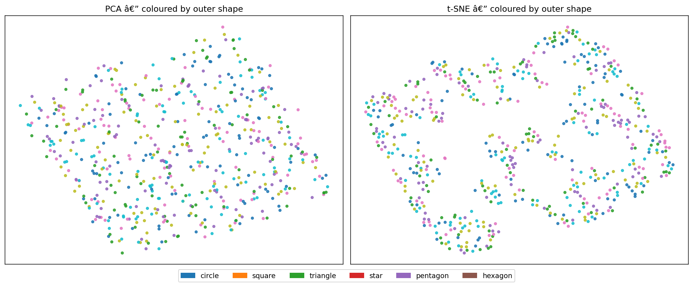
</div>

The clusters separate cleanly by shape — a sanity check that the encoder has internalised geometry.

---

## 🧪 18. Ablation Study

> **Does cross-attention actually help, or is it just adding parameters?**

We trained two decoder variants under a **matched 6-epoch budget**:

<div align="center">
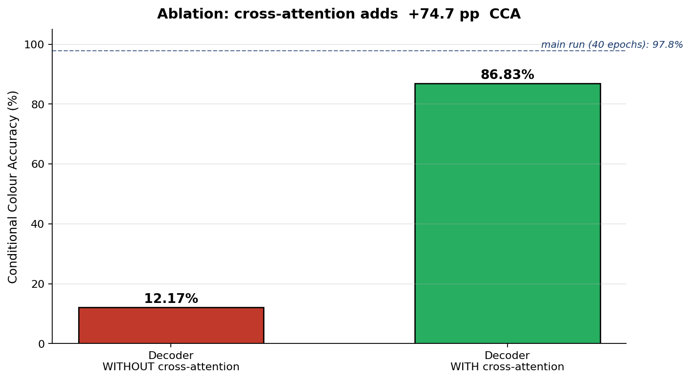
</div>

| Variant | Conditional Colour Accuracy |
|---|---:|
| Decoder *with* cross-attention | **86.83 %** |
| Decoder *without* cross-attention | 12.17 % |
| **Δ** | **+74.7 pp** |

Cross-attention is the dominant contributor to compositional fidelity — without it, the model collapses to an unconditioned mean.

---

## 🐛 19. Error Analysis

Worst-MSE reconstructions on the test set (top: ground truth, bottom: reconstruction):

<div align="center">
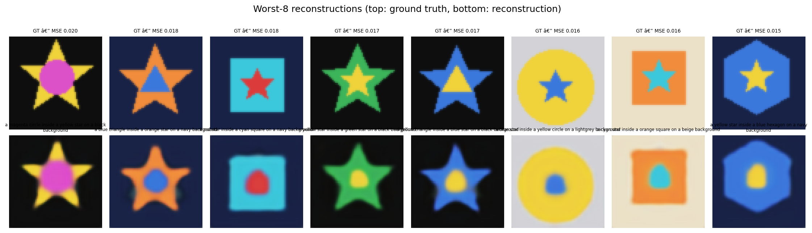
</div>

Errors concentrate on the inner shape of *nested* compositions where the inner radius is small (12 px) — a known limitation discussed in [§28](#-28-limitations).

---

## 📈 20. Performance Metrics

```json
{
  "test_loss": 0.0181,
  "recon_mse": 0.0143,
  "kl": 0.0372,
  "conditional_color_accuracy": 0.9783
}
```

```json
{
  "no_attention_CCA":   0.1217,
  "with_attention_CCA": 0.8683,
  "delta":              0.7467
}
```

History (per-epoch loss / KL / lr / β / wall-time) is in [`results/history.json`](results/history.json).

---

## 📁 21. Project Structure

```
.
├── final_project.ipynb        ← single source notebook (all 40 sections)
├── BRIEF.md                   ← 1–2 page brief (dataset · architecture · results · improvements)
├── README.md                  ← this file
├── requirements.txt
├── LICENSE                    ← MIT
├── .gitignore
│
├── samples/                   ← 5 final samples + 64-icon gallery
├── figures/                   ← training curves · style transfer · attention · latent · errors
├── results/                   ← metrics.json · ablation.json · history.json · kaggle_kernel.log
├── app/                       ← Gradio smoke-test stills
├── checkpoints/               ← (downloaded separately — see § 25)
├── assets/                    ← architecture · pipeline · ablation · hero diagrams
└── README_assets/             ← inline images for this README
```

---

## ⚙️ 22. Installation

```bash
git clone https://github.com/Mohameddfxxcxx/CrossAttention-IconFusion-AI
cd CrossAttention-IconFusion-AI
python -m venv venv && source venv/bin/activate           # Windows: venv\Scripts\Activate.ps1
pip install -r requirements.txt
jupyter lab final_project.ipynb
```

The first cell of the notebook auto-installs anything missing — dependency drift between Colab / Kaggle / local environments is handled automatically.

---

## 🟧 23. Run on Kaggle

[](https://www.kaggle.com/code/mohamedelsadek44/geometric-icons-cond-vae)

1. Open the [public Kaggle kernel](https://www.kaggle.com/code/mohamedelsadek44/geometric-icons-cond-vae).
2. *Copy & Edit* → Settings → Accelerator → **GPU (T4 / P100)** → Internet **on**.
3. *Save Version* → *Save & Run All (Commit)*.
4. Outputs land in `/kaggle/working/`.

---

## 🟦 24. Run on Colab

[](https://colab.research.google.com/github/Mohameddfxxcxx/CrossAttention-IconFusion-AI/blob/main/final_project.ipynb)

1. Click the badge → opens directly in Colab.
2. *Runtime* → *Change runtime type* → **GPU (T4 / A100)**.
3. *Run all* (`Ctrl+F9`).
4. Set `FORCE_LAUNCH = True` in the last cell to launch the public Gradio URL.

---

## 💻 25. Local Execution

```bash
git clone https://github.com/Mohameddfxxcxx/CrossAttention-IconFusion-AI
cd CrossAttention-IconFusion-AI
pip install -r requirements.txt
jupyter lab final_project.ipynb
```

The trained checkpoints aren't in this repo (each is ~66 MB). To use the trained model, either:

- **Re-run** the notebook on Colab/Kaggle (~13 min on a P100), **or**
- **Download** them from the public Kaggle kernel:
  ```bash
  pip install kaggle
  kaggle kernels output mohamedelsadek44/geometric-icons-cond-vae -p ./
  ```

---

## 🎮 26. Gradio App

The notebook ends with a polished 6-tab Gradio interface:

| Tab | Purpose |
|---|---|
| 🎲 **1. Random Generation** | sample a fresh icon from a random structured prompt |
| 🧩 **2. Shape Composition** | hand-design outer/inner shape, colour, background, nesting |
| 🎨 **3. Style Transfer** | AdaIN content × style with α slider |
| 🔥 **4. Cross-Attention** | per-token attention heatmaps |
| 🧭 **5. Latent Explorer** | slide the first 8 z-dimensions |
| 🖼️ **6. Gallery** | regenerate a fresh 64-icon grid |

All tabs include **examples**, **download buttons**, and a **soft theme**. Set `FORCE_LAUNCH = True` and `share=True` for a public URL.

<div align="center">
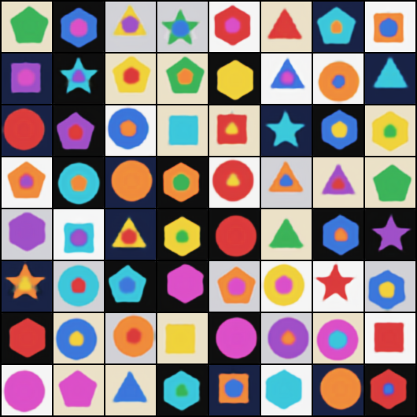
</div>

---

## 🔁 27. Reproducibility

- **Seed** — 1337, fixed for `random`, `numpy`, and `torch`.
- **Hyperparameters** — single `Config` dataclass in §22 of the notebook.
- **History** — every metric per epoch is dumped to `results/history.json`.
- **Kaggle log** — full stdout/stderr archived to `results/kaggle_kernel.log`.
- **Public kernel** — runs are versioned at https://www.kaggle.com/code/mohamedelsadek44/geometric-icons-cond-vae and can be reproduced with one click.

---

## ⚠️ 28. Limitations

- **Synthetic domain.** The dataset is procedurally generated — generalisation to *natural* icons (SVG icon packs, FontAwesome, Material) is untested.
- **Resolution.** 64 × 64 keeps the model snappy on a free GPU but is too low for nuanced texture style transfer.
- **VAE blur.** Even with the L1 component, conditional VAEs produce slightly soft edges; a small adversarial term or a diffusion head would sharpen them further.
- **Categorical conditioner.** There is no genuine *text encoder* — conditions are 6 categorical labels. A frozen CLIP text encoder would unlock free-form prompts.
- **Inner-shape fidelity.** With an inner radius of only 12 px the inner shape sometimes reads as a disc.

---

## 🛣️ 29. Future Improvements

1. **CLIP text conditioning** for free-form prompts.
2. **Tiny U-Net diffusion decoder** with v-prediction (Salimans & Ho, 2022) — the cross-attention block ports unchanged.
3. **LPIPS perceptual loss** for crisper reconstructions.
4. **β-TC-VAE-style disentanglement metrics** on shape × colour.
5. **128 × 128 resolution** with a deeper encoder/decoder.
6. **ONNX export** so the Gradio app can run client-side.

---

## 📝 30. Citation

If you use this code or the dataset generator in your research, please cite:

```bibtex
@misc{elsadek2026genicons,
  title  = {Generative Geometric Icons: A Conditional VAE with Cross-Attention and AdaIN Style Transfer},
  author = {El-sadek, Mohamed},
  year   = {2026},
  publisher = {GitHub},
  howpublished = {\url{https://github.com/Mohameddfxxcxx/CrossAttention-IconFusion-AI}}
}
```

---

## 📚 31. References (Harvard)

- **Kingma, D.P. & Welling, M.** (2014) *Auto-Encoding Variational Bayes*. arXiv:1312.6114.
- **Sohn, K., Yan, X. & Lee, H.** (2015) *Learning Structured Output Representation Using Deep Conditional Generative Models*. NeurIPS.
- **Higgins, I. et al.** (2017) *β-VAE: Learning Basic Visual Concepts with a Constrained Variational Framework*. ICLR.
- **Vaswani, A. et al.** (2017) *Attention Is All You Need*. NeurIPS.
- **Huang, X. & Belongie, S.** (2017) *Arbitrary Style Transfer in Real-time with Adaptive Instance Normalization*. ICCV.
- **Rombach, R. et al.** (2022) *High-Resolution Image Synthesis with Latent Diffusion Models*. CVPR.
- **Ho, J., Jain, A. & Abbeel, P.** (2020) *Denoising Diffusion Probabilistic Models*. NeurIPS.
- **Salimans, T. & Ho, J.** (2022) *Progressive Distillation for Fast Sampling of Diffusion Models*. ICLR.
- **Radford, A. et al.** (2021) *Learning Transferable Visual Models From Natural Language Supervision (CLIP)*. ICML.
- **Goodfellow, I. et al.** (2014) *Generative Adversarial Nets*. NeurIPS.
- **Paszke, A. et al.** (2019) *PyTorch: An Imperative Style, High-Performance Deep Learning Library*. NeurIPS.
- **Abid, A. et al.** (2019) *Gradio: Hassle-Free Sharing and Testing of ML Models in the Wild*. arXiv:1906.02569.

---

## 📄 32. License

This project is released under the **MIT License** — see [`LICENSE`](LICENSE).

© 2026 **Mohamed El-sadek**.

---

## 🙏 33. Acknowledgements

- The **PyTorch** team for the framework that makes this possible.
- The **Gradio** team for letting an entire research demo fit into one Python cell.
- **Kaggle** for the free GPU runtime.
- **Anthropic Claude Code** as a pair-programmer during development.
- Every author cited in §31 — this work stands on their shoulders.

---

<div align="center">

Built with ❤️ and PyTorch by <a href="https://github.com/Mohameddfxxcxx"><b>Mohamed El-sadek</b></a>

⭐ Star this repo if you found it useful!

</div>
